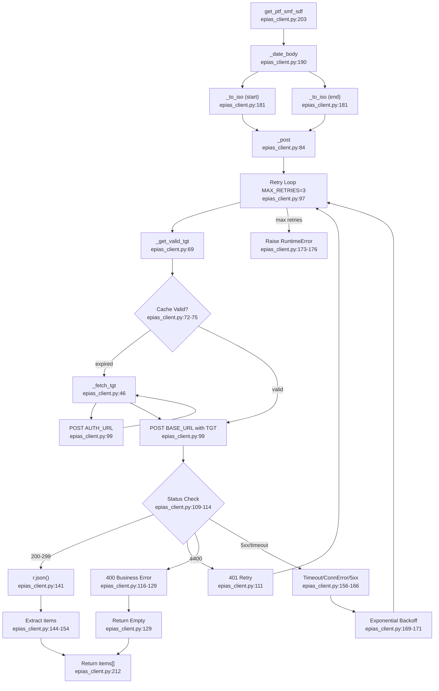

# F01 · EPIAS API Client

Entry: `src/epias_client.py:24` — `EPIASClient`

## Happy Path: `get_ptf_smf_sdf(start_date, end_date)`

## External Dependencies
- `requests` — HTTP POST (lines 49, 99)
- `dotenv` — `.env` loading (line 11)
- `datetime`, `time`, `os`, `json`, `logging`, `typing`
- Constants: `AUTH_URL:16`, `BASE_URL:17`, `TGT_LIFETIME`, `MAX_RETRIES=3`, `RETRY_BACKOFF=2.0`

## Side Effects
- Token cache written: `self._tgt`, `self._token_time` (lines 77–78)
