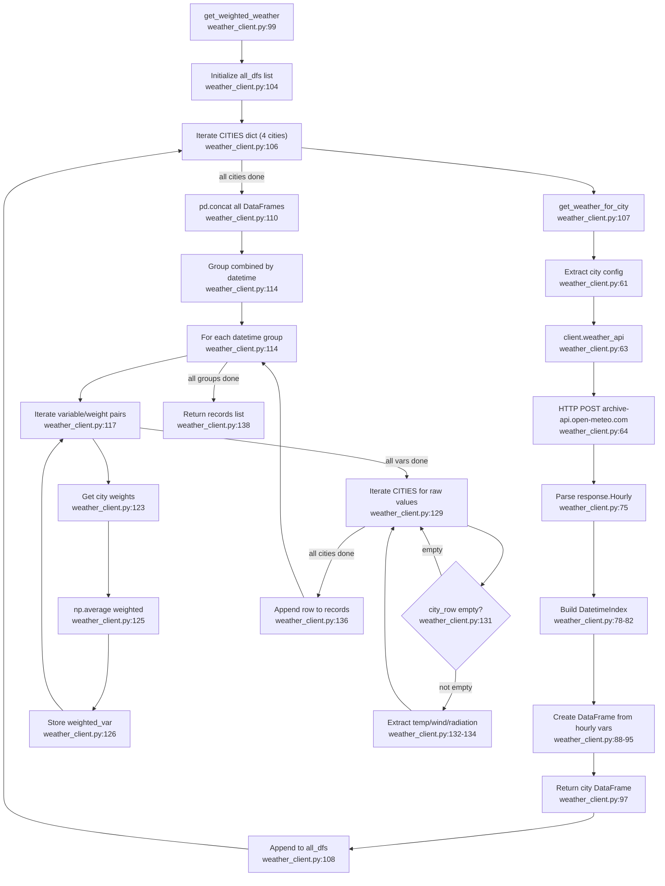

# F02 · Weather API Client

Entry: `src/weather_client.py:99` — `get_weighted_weather(start_date, end_date)`

## External Dependencies
- `openmeteo_requests.Client` — weather API client (line 54)
- `requests_cache.CachedSession` — HTTP cache 3600s TTL (line 52)
- `retry_requests.retry` — 5 retries, 0.2 backoff (line 53)
- `pandas` — DataFrame ops
- `numpy` — `np.average()` weighted calc (line 125)

## Side Effects
- HTTP response cached via `requests_cache` session
- No writes to external storage
