# F03 · Daily Bronze→Silver ETL (Spark)

Entry: `spark_jobs/spark_utils.py:13` — `BaseEpiasSparkJob`

```mermaid
flowchart TD
    Start["Start bronze_to_silver_*.py:~40"]
    JobInit["Subclass.__init__<br/>bronze_to_silver_pricing.py:7-12"]
    BaseInit["BaseEpiasSparkJob.__init__<br/>spark_utils.py:14-46"]
    DetectBackfill{"--backfill flag?<br/>spark_utils.py:20"}
    ConfigNormal["DYNAMIC partition overwrite<br/>spark_utils.py:26-30"]
    ConfigBackfill["+ GCS streaming config<br/>+ 400 shuffle partitions<br/>spark_utils.py:32-40"]
    SparkReady["SparkSession created<br/>spark_utils.py:42"]
    RunMethod["job.run(ds)<br/>bronze_to_silver_pricing.py:14"]
    ReadBronze["read_bronze(ds)<br/>spark_utils.py:49"]
    ReadDaily["Read gs://.../bronze/{source}/{ds}.parquet<br/>spark_utils.py:59"]
    ReadBackfill["_read_bronze_backfill<br/>spark_utils.py:64"]
    ListFiles["List backfill_*.parquet via binaryFile<br/>spark_utils.py:81-84"]
    ReadRef["Read reference schema from first file<br/>spark_utils.py:91-92"]
    UnionLoop["Schema-drift cast + unionByName per file<br/>spark_utils.py:95-104"]
    Normalize["_normalize() — unwrap body/items nesting<br/>spark_utils.py:109-116"]
    CheckEmpty{"df empty?<br/>bronze_to_silver_pricing.py:16"}
    ReturnEarly["Return early (no data)<br/>bronze_to_silver_pricing.py:16"]
    BusinessLogic["Job-specific: aliases + type casts<br/>bronze_to_silver_pricing.py:18-32"]
    TimestampCast["F.to_timestamp(date, ISO format)<br/>bronze_to_silver_pricing.py:28"]
    NumericCast["Cast numeric cols to DoubleType<br/>bronze_to_silver_pricing.py:32"]
    PartitionCols["add_partition_columns(df, ds)<br/>spark_utils.py:118"]
    ParseDs["Parse ds string → year/month/day<br/>spark_utils.py:137-139"]
    DeriveData["Extract year/month/day from data.date<br/>spark_utils.py:124-134"]
    Dedup["deduplicate(df)<br/>spark_utils.py:141"]
    CheckPKs["Resolve primary_keys (fallback alternatives)<br/>spark_utils.py:143-150"]
    DropDups["dropDuplicates(valid_keys)<br/>spark_utils.py:157"]
    AddHash["Add _record_hash (MD5)<br/>spark_utils.py:159-162"]
    WriteSilver["write_silver(df)<br/>spark_utils.py:164"]
    WriteOverwrite["mode = overwrite<br/>spark_utils.py:178"]
    RepartBackfill["repartition(200, year, month, day)<br/>spark_utils.py:183"]
    WriteAppend["mode = append<br/>spark_utils.py:178"]
    WriteParquet["Write partitioned parquet<br/>gs://epias-data-lake/silver/{source}/<br/>spark_utils.py:187-190"]
    SparkStop["spark.stop()<br/>bronze_to_silver_pricing.py:37"]

    Start --> JobInit --> BaseInit --> DetectBackfill
    DetectBackfill -->|No| ConfigNormal --> SparkReady
    DetectBackfill -->|Yes| ConfigBackfill --> SparkReady
    SparkReady --> RunMethod --> ReadBronze
    ReadBronze -->|Normal| ReadDaily --> Normalize
    ReadBronze -->|Backfill| ReadBackfill --> ListFiles --> ReadRef --> UnionLoop --> Normalize
    Normalize --> CheckEmpty
    CheckEmpty -->|Empty| ReturnEarly --> SparkStop
    CheckEmpty -->|Data| BusinessLogic --> TimestampCast --> NumericCast --> PartitionCols
    PartitionCols -->|Normal| ParseDs --> Dedup
    PartitionCols -->|Backfill| DeriveData --> Dedup
    Dedup --> CheckPKs --> DropDups --> AddHash --> WriteSilver
    WriteSilver -->|Normal| WriteOverwrite --> WriteParquet
    WriteSilver -->|Backfill| RepartBackfill --> WriteAppend --> WriteParquet
    WriteParquet --> SparkStop
```

## Per-Job Divergences
| Job | Primary Keys | Notes |
|-----|---|---|
| `bronze_to_silver_pricing.py` | `["date","hour"]` | Standard pattern |
| `bronze_to_silver_generation.py` | `["date"]` | Multi-col type loop |
| `bronze_to_silver_dams.py` | `["date","basinName"]` | Compound PK on location |
| `bronze_to_silver_market.py` | `["org_id"]` | **LEGACY**: uses undefined `get_spark_session()`; doesn't inherit `BaseEpiasSparkJob` |

## External Dependencies
- PySpark 3.x — SparkSession, SQL functions
- Google Cloud Storage (`gs://epias-data-lake`) — Bronze/Silver I/O
- `sys`, `logging`
