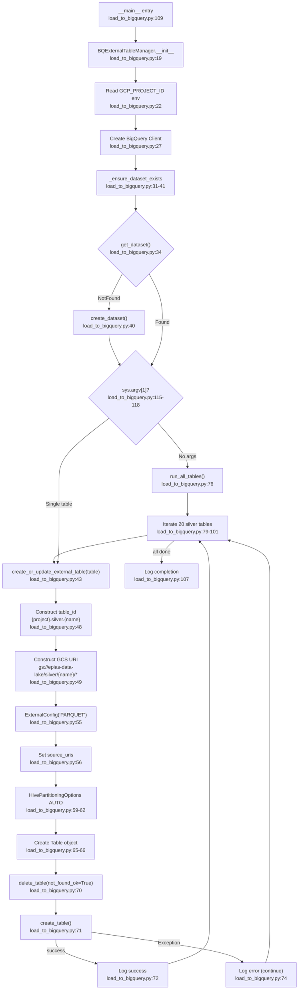

# F04 · BigQuery External Table Bridge

Entry: `src/load_to_bigquery.py:18` — `BQExternalTableManager`

## Idempotency
Delete-before-create ensures schema changes are always applied. `not_found_ok=True` safe on first run.

## External Dependencies
- `google.cloud.bigquery` — Client, ExternalConfig, HivePartitioningOptions
- `google.api_core.exceptions.NotFound`
- GCS bucket: `epias-data-lake/silver/{table}/*`
- Env: `GCP_PROJECT_ID` (default: `epias-data-platform`)

## Called From
- `dags/epias_dag.py:248` (daily, BashOperator)
- `dags/epias_backfill_dag.py:292` (backfill, BashOperator)
