# F05 · dbt Gold Transformation Layer

Entry: `epias_dbt/dbt_project.yml` → `models/staging/` → `models/marts/`

```mermaid
flowchart TD
    Silver["Silver External Tables<br/>sources.yml:3-109<br/>(24 tables)"]

    S1["stg_pricing<br/>stg_pricing.sql:1-25"]
    S2["stg_generation<br/>stg_generation.sql:1-43"]
    S3["stg_load_estimation<br/>stg_load_estimation.sql:1-16"]
    S4["stg_res_forecast<br/>stg_res_forecast.sql:1-20"]
    S5["stg_smf<br/>stg_smf.sql:1-8"]
    S6["stg_dam_clearing<br/>stg_dam_clearing.sql:1-17"]
    S7["stg_aic<br/>stg_aic.sql:1-28"]
    S8["stg_imbalance<br/>stg_imbalance.sql:1-10"]
    S9["stg_outages<br/>stg_outages.sql:1-17"]
    S10["stg_idm_transactions<br/>stg_idm_transactions.sql:1-11"]
    S11["stg_system_direction<br/>stg_system_direction.sql:1-7"]
    S12["stg_order_up<br/>stg_order_up.sql:1-12"]
    S13["stg_order_down<br/>stg_order_down.sql:1-13"]
    S14["stg_supply_demand_curve<br/>stg_supply_demand_curve.sql:1-21"]
    S15["stg_price_ind_bid<br/>stg_price_ind_bid.sql:1-8"]

    Silver --> S1 & S2 & S3 & S4 & S5 & S6 & S7 & S8 & S9 & S10 & S11 & S12 & S13 & S14 & S15

    M1["mart_ml_features<br/>mart_ml_features.sql:1-173<br/>(11 stg inputs + M5 + M6)"]
    M2["mart_supply_shock_index<br/>mart_supply_shock_index.sql:1-40"]
    M3["mart_forecasted_residual_load<br/>mart_forecasted_residual_load.sql:1-51"]
    M4["mart_price_analysis<br/>mart_price_analysis.sql:1-16"]
    M5["mart_gip_company_activity<br/>mart_gip_company_activity.sql:1-15"]
    M6["mart_cross_market_spread<br/>mart_cross_market_spread.sql:1-174"]
    M7["mart_merit_order<br/>mart_merit_order.sql:1-24"]
    M8["mart_generation_mix<br/>mart_generation_mix.sql:1-10"]
    M9["mart_ptf_drivers<br/>mart_ptf_drivers.sql:1-17"]
    M10["mart_gop_volume_analysis<br/>mart_gop_volume_analysis.sql:1-22"]
    M11["mart_renewable_deep<br/>mart_renewable_deep.sql:1-18"]
    M12["mart_ptf_lag_features<br/>mart_ptf_lag_features.sql:1-42"]

    S1 & S5 & S3 & S4 & S9 & S6 & S7 & S2 & S8 & S10 & S11 --> M1
    M5 & M6 --> M1
    S9 & S7 --> M2
    S3 & S4 & S15 & S1 --> M3
    S1 & S5 --> M4
    S10 --> M5
    S1 & S10 & S5 & S11 & S8 & S12 & S13 --> M6
    S14 & S1 --> M7
    S2 --> M8
    S1 & S5 & S3 & S4 --> M9
    S6 & S1 --> M10
    S2 & S4 --> M11
    M1 --> M12

    TRAINER["ptf_trainer.py<br/>(F06)"]
    INFER["ptf_inference.py<br/>(F07)"]
    DASHBOARD["dashboard.py<br/>(F13)"]

    M3 & M2 --> TRAINER
    M12 --> INFER
    M4 & M8 & M11 & M10 & M9 & M2 & M12 & M1 --> DASHBOARD
```

## Materialization
- Staging: 15 incremental views, `partition_by date`, `unique_key` MERGE
- Marts: 23+ incremental/full tables, all `partition_by date`

## Key Cascade
`mart_ptf_lag_features` depends on `mart_ml_features` — the only mart→mart dependency.
