# F06 · PTF Trainer (GCS-backed XGBoost)

Entry: `src/ptf_trainer.py:161` — `run()`

```mermaid
flowchart TD
    Start["run()<br/>ptf_trainer.py:161"]
    Extract["extract_training_data()<br/>ptf_trainer.py:30-54"]
    BQRead["BigQuery JOIN<br/>mart_forecasted_residual_load<br/>+ mart_supply_shock_index<br/>ptf_trainer.py:35-49"]
    ConvertIdx["Set datetime index<br/>ptf_trainer.py:51-52"]
    Engineer["engineer_features()<br/>ptf_trainer.py:59-98"]
    Temporal["hour, day_of_week, month, is_weekend<br/>ptf_trainer.py:63-66"]
    Lags["ptf_lag_24h, ptf_lag_168h<br/>ptf_trainer.py:68-69"]
    FwdFill["Forward-fill supply cols<br/>ptf_trainer.py:77-79"]
    Rolling["supply_shock_trend_7d (168h mean)<br/>ptf_trainer.py:81"]
    DropNaN["dropna(ptf_try, lags, supply_shock_trend_7d)<br/>ptf_trainer.py:96"]
    ValidateData{"rows >= 888?<br/>ptf_trainer.py:166"}
    SkipTrain["Log warning + return<br/>ptf_trainer.py:167-171"]
    Train["train()<br/>ptf_trainer.py:103-148"]
    SplitDate["split_date = max - 30d<br/>ptf_trainer.py:108"]
    TrainTest["X_train/y_train | X_test/y_test<br/>ptf_trainer.py:109-112"]
    InitModel["XGBRegressor<br/>n_estimators=800, lr=0.03, depth=6<br/>ptf_trainer.py:114-123"]
    FitModel["fit with eval_set<br/>early_stopping_rounds=50<br/>ptf_trainer.py:124-128"]
    Predict["predict X_test<br/>ptf_trainer.py:130"]
    CalcMetrics["MAE + sMAPE<br/>ptf_trainer.py:131-138"]
    CalcImportance["feature_importances_<br/>ptf_trainer.py:142-145"]
    SaveLocal["joblib.dump → /tmp/ptf_xgb_model.joblib<br/>ptf_trainer.py:181"]
    SaveCSV["importance → /tmp/ptf_shap_importance.csv<br/>ptf_trainer.py:182"]
    UploadModel["upload_to_gcs<br/>gs://epias-data-lake/models/ptf_xgb_model.joblib<br/>ptf_trainer.py:184"]
    UploadCSV["upload_to_gcs<br/>gs://epias-data-lake/models/ptf_shap_importance.csv<br/>ptf_trainer.py:185"]

    Start --> Extract --> BQRead --> ConvertIdx --> Engineer
    Engineer --> Temporal --> Lags --> FwdFill --> Rolling --> DropNaN
    DropNaN --> ValidateData
    ValidateData -->|No| SkipTrain
    ValidateData -->|Yes| Train
    Train --> SplitDate --> TrainTest --> InitModel --> FitModel --> Predict --> CalcMetrics --> CalcImportance
    CalcImportance --> SaveLocal --> SaveCSV --> UploadModel --> UploadCSV
```

## Features Used (12 total)
`hour`, `day_of_week`, `month`, `is_weekend`, `ptf_lag_24h`, `ptf_lag_168h`, `forecasted_residual_load_mwh`, `price_independent_bid_mwh`, `total_available_capacity_mwh`, `total_outage_mwh`, `supply_shock_index`, `supply_shock_trend_7d`

## GCS Artifacts
- `gs://epias-data-lake/models/ptf_xgb_model.joblib` (model + feature list dict)
- `gs://epias-data-lake/models/ptf_shap_importance.csv`

## BQ Tables Read
- `epias_gold.mart_forecasted_residual_load`
- `epias_gold.mart_supply_shock_index`
