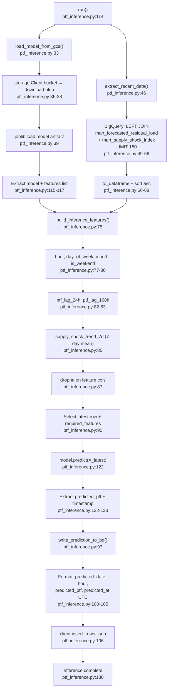

# F07 · PTF Inference (Hourly, GCS-backed)

Entry: `src/ptf_inference.py:114` — `run()`

## GCS Read
- `gs://epias-data-lake/models/ptf_xgb_model.joblib` (line 24)

## BQ Read
- `epias_gold.mart_forecasted_residual_load` (join left)
- `epias_gold.mart_supply_shock_index` (join right, on `date`)
- Lookback: 180 rows (line 28)

## BQ Write
- `epias_gold.gold_ptf_predictions` — schema: `predicted_date`, `hour`, `predicted_ptf`, `predicted_at`

## Feature Overlap with F06
Same 12 features as F06 trainer. Model artifact is the bridge.
