# F08 · PTF Forecaster (Local-disk XGBoost)

Entry: `src/ptf_forecaster.py:20` — `PredictivePTFForecaster`

```mermaid
flowchart TD
    Init["PredictivePTFForecaster.__init__<br/>ptf_forecaster.py:21"]
    SetPaths["Set GCP/BQ params + local model path<br/>ptf_forecaster.py:22-26"]
    Extract["extract_gold_data()<br/>ptf_forecaster.py:28"]
    BQQuery["SELECT 21 features from mart_ml_features<br/>ptf_forecaster.py:38-61"]
    ParseTS["to_dataframe + datetime index<br/>ptf_forecaster.py:64-66"]
    Engineer["engineer_features()<br/>ptf_forecaster.py:69"]
    Lags["ptf_lag_24h/48h/168h<br/>ptf_forecaster.py:80-82"]
    Rolling["ptf_rolling_avg_24h/168h/std_24h<br/>ptf_forecaster.py:85-87"]
    Domain["gop_imbalance_lag_24h<br/>cap_util_rolling_7d<br/>ptf_forecaster.py:91,94-96"]
    Cyclic["hour/dow/month sin/cos encoding<br/>ptf_forecaster.py:100-105"]
    Interact["is_weekend, hour_x_dow<br/>ptf_forecaster.py:108,113"]
    Dropna["dropna lag warmup<br/>ptf_forecaster.py:116"]
    TrainEval["train_and_evaluate()<br/>ptf_forecaster.py:119"]
    ExcludeRaw["Exclude raw target cols<br/>ptf_forecaster.py:129-134"]
    WFLoop["Walk-forward CV: 3 folds<br/>ptf_forecaster.py:138"]
    TestWindow["test_end/test_start (30d window)<br/>ptf_forecaster.py:139-140"]
    SplitData["Expanding train | Fixed 30d test<br/>ptf_forecaster.py:142-145"]
    DataGuard{"rows > 500?<br/>ptf_forecaster.py:147-148"}
    FitFold["XGBRegressor fit + eval_set<br/>ptf_forecaster.py:150-159"]
    PredictFold["predict fold test<br/>ptf_forecaster.py:161"]
    FoldMetrics["MAE/RMSE/MAPE per fold<br/>ptf_forecaster.py:162-166"]
    AvgMetrics["Avg metrics across folds<br/>ptf_forecaster.py:169-171"]
    FinalModel["XGBRegressor on full data<br/>ptf_forecaster.py:175-184"]
    Importance["feature_importances_ → CSV local disk<br/>ptf_forecaster.py:189-191"]
    SaveModel["joblib.dump → models/ptf_advanced_xgb_model.joblib<br/>ptf_forecaster.py:194"]
    Done["run() complete<br/>ptf_forecaster.py:200"]

    Init --> SetPaths --> Extract --> BQQuery --> ParseTS --> Engineer
    Engineer --> Lags --> Rolling --> Domain --> Cyclic --> Interact --> Dropna
    Dropna --> TrainEval --> ExcludeRaw --> WFLoop
    WFLoop --> TestWindow --> SplitData --> DataGuard
    DataGuard -->|enough data| FitFold --> PredictFold --> FoldMetrics --> WFLoop
    WFLoop -->|3 folds done| AvgMetrics --> FinalModel --> Importance --> SaveModel --> Done
```

## Key Differences vs F06 (PTF Trainer)

| Dimension | F06 `ptf_trainer.py` | F08 `ptf_forecaster.py` |
|---|---|---|
| BQ source | 2 marts (join) | 1 mart (`mart_ml_features`) |
| Lag features | 24h, 168h | 24h, **48h**, 168h |
| Rolling features | `supply_shock_trend_7d` | avg 24h/168h + std 24h |
| Cyclic encoding | None | sin/cos for hour/dow/month |
| Interaction terms | None | `hour_x_dow` |
| CV strategy | Single 30-day holdout | Walk-forward 3-fold CV |
| Model artifact | → **GCS** | → **local disk** |
| Used by inference | Yes (F07 loads from GCS) | **No downstream consumer** |

## BQ Table Read
- `{PROJECT}.{DATASET}.mart_ml_features` (21 features, line 61)

## Local Artifacts
- `models/ptf_advanced_xgb_model.joblib`
- `models/ptf_shap_importance.csv`
