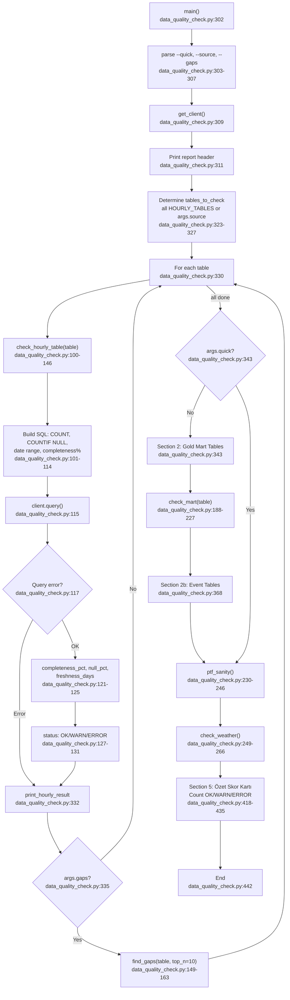

# F09 · Data Quality Monitor

Entry: `src/data_quality_check.py:302` — `main()`

## Check Types
| Check | Target | Key Metric |
|---|---|---|
| `check_hourly_table` | 11 hourly staging tables | completeness% vs EXPECTED_HOURS (2025-01-01→today) |
| `find_gaps` | same | days with <24 hours |
| `check_mart` | 11 gold mart tables | freshness_days, row count |
| `ptf_sanity` | `stg_pricing` | avg/min/max/stddev PTF, outlier count |
| `check_weather` | `stg_weather` | per-city coverage |

## External Dependencies
- `google.cloud.bigquery` — BigQuery client
- `pandas`, `datetime`, `argparse`, `logging`
- Env: `GCP_PROJECT_ID`, `BQ_GOLD_DATASET`
