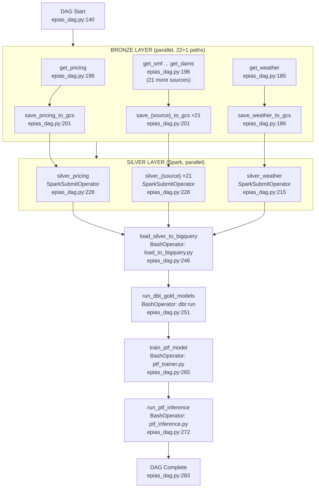

# F10 · Daily Medallion DAG (Airflow)

Entry: `dags/epias_dag.py:140` — DAG `epias_medallion_pipeline_v3`

Schedule: `0 5 * * *` (05:00 UTC daily)

## Task Count
- 22 `get_*` tasks (dynamically generated from `ALL_SOURCES`)
- 22 `save_*_to_gcs` tasks
- 22 `silver_*` SparkSubmitOperator tasks
- 1 `get_weather` + 1 `save_weather_to_gcs` + 1 `silver_weather` (hardcoded)
- 4 terminal tasks
- **Total: ~73 tasks**

## Dynamic Generation
`ALL_SOURCES = HOURLY_SOURCES ∪ {participants}` (lines 154–182)

For each key: `get_{key}` (PythonOperator) → `save_{key}_to_gcs` (PythonOperator) → `silver_{key}` (SparkSubmitOperator)

## External Module Calls
- `EPIASClient` — `src/epias_client.py:24`
- `WeatherClient` — `src/weather_client.py:50`
- `load_to_bigquery.py` — `src/load_to_bigquery.py:109`
- `ptf_trainer.py` — `src/ptf_trainer.py:161`
- `ptf_inference.py` — `src/ptf_inference.py:114`
- GCS Connector JAR (line 219)
