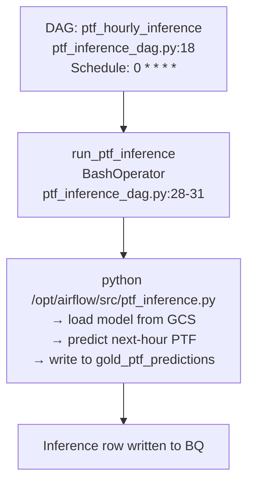

# F11 · Hourly PTF Inference DAG (Airflow)

Entry: `dags/ptf_inference_dag.py:18` — DAG `ptf_hourly_inference`

Schedule: `0 * * * *` (every hour on the hour)

## Configuration
| Property | Value |
|---|---|
| DAG ID | `ptf_hourly_inference` |
| Start Date | 2025-01-01 |
| Catchup | False |
| Max Active Runs | 1 |
| Retries | 2 with 2-min delay |
| Task Count | 1 |

## Notes
- Completely **independent** from daily medallion DAG (`epias_dag.py`)
- Calls `src/ptf_inference.py` — see F07 for full flow
- Only depends on: GCS model artifact + BigQuery Silver mart data
