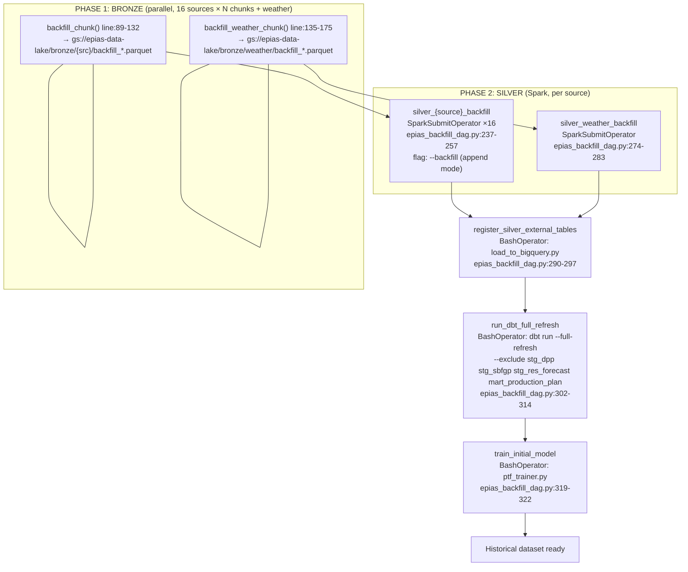

# F12 · Historical Backfill DAG (Airflow)

Entry: `dags/epias_backfill_dag.py:40` — DAG `epias_historical_backfill`

Schedule: `None` — **manual trigger only**

## Scale (2025-01-01 to 2026-06-06)
- ~76 weekly chunks × 16 sources = ~1,216 bronze tasks
- 16 EPIAS + 1 weather silver tasks
- 3 sequential gate tasks
- **~1,235+ dynamic tasks total**

## Key Overlaps with Daily DAG (F10)
| Task | Backfill DAG | Daily DAG | Same script? |
|---|---|---|---|
| BQ bridge | `register_silver_external_tables` line:292 | `load_silver_to_bigquery` line:248 | YES — `load_to_bigquery.py` |
| dbt run | `run_dbt_full_refresh` line:310 | `run_dbt_gold_models` line:258 | YES — same dbt project; different flags (`--full-refresh` vs incremental) |
| PTF train | `train_initial_model` line:321 | `train_ptf_model` line:267 | YES — `ptf_trainer.py` |
| Spark jobs | `silver_{source}_backfill` line:239 | `silver_{key}` line:228 | YES — same scripts; different args |
| Bronze ingest | `bronze_{source}_{chunk}` line:213 | `get_{key}` + `save_{key}_to_gcs` | SAME METHODS — different chunk/save pattern |

## dbt Model Exclusions (identical in both DAGs)
`stg_dpp`, `stg_sbfgp`, `stg_res_forecast`, `mart_production_plan`
- Backfill: `epias_backfill_dag.py:310-313`
- Daily: `epias_dag.py:258-261`
