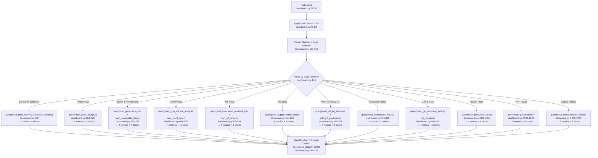

# F13 · Streamlit Analytics Dashboard

Entry: `dashboard.py:33` — `st.set_page_config`

## Gold Tables Consumed (14)
`mart_gold_monthly_executive_metrics`, `mart_price_analysis`, `mart_generation_mix`, `mart_renewable_deep`, `mart_gop_volume_analysis`, `mart_merit_order`, `mart_forecasted_residual_load`, `mart_ptf_drivers`, `mart_supply_shock_index`, `mart_ptf_lag_features`, `gold_ptf_predictions`, `mart_unlicensed_impact`, `mart_gip_company_activity`, `mart_production_plan`, `mart_ptf_extremes`, `mart_cross_market_spread`

Note: `stg_weather` (staging) is also queried directly on page 9 (line 974).

## External Dependencies
- `streamlit`, `plotly.express/graph_objects/subplots`
- `google.cloud.bigquery`, `google.oauth2.service_account`
- `pandas`, `os`, `logging`
- Credentials: `st.secrets["gcp_service_account"]`

## Caching
- `@st.cache_resource` for BQ client (line 115)
- `@st.cache_data(ttl=3600)` for query results (line 126)
