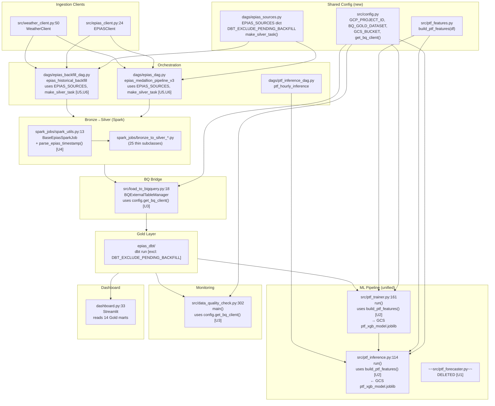

# Unified Architecture Proposal — epias_data_platform

Generated: 2026-06-06

Based on `02-duplication-report.md`. The orchestrator synthesizes D01–D07 into the minimum changes needed.

---

## U1 · Retire `ptf_forecaster.py` — Unify into One Training Pipeline (D01)

**Problem:** F08 (`ptf_forecaster.py`) trains a PTF model that is never consumed. F06 (`ptf_trainer.py`) feeds the production inference loop. Both are active code with divergent feature sets. The local-disk model from F08 is dead output.

**Proposed action:**
1. Delete `src/ptf_forecaster.py`. No call site exists in any DAG; no file imports it.
2. If the walk-forward CV or the extended features (sin/cos encoding, 48h lag, GÖP imbalance) were intentional improvements, backport the specific improvements into `ptf_trainer.py` one at a time with tests.
3. The single trainer (`ptf_trainer.py`) remains the sole training path, writing to `gs://epias-data-lake/models/ptf_xgb_model.joblib`.

**What each old call site becomes:**
- `dags/epias_dag.py:265` (`train_ptf_model`) — unchanged, already calls `ptf_trainer.py`
- `src/ptf_forecaster.py:197-203` (`run()`) — deleted

**Loss of capability:** Walk-forward CV and cyclic feature encoding exist only in F08. Before deleting, decide whether to backport walk-forward CV to `ptf_trainer.py` (recommend yes — it's strictly better than single holdout). Cyclic encoding vs. integer encoding for hour/dow is a modeling choice; test which gives better MAE before committing.

---

## U2 · Extract Shared Feature Construction (`src/ptf_features.py`) (D02)

**Problem:** `ptf_trainer.py` and `ptf_inference.py` independently implement the same lag/rolling/temporal feature construction. A change to feature logic in one doesn't propagate to the other, risking train/serve skew at inference time.

**Proposed action:** Create `src/ptf_features.py` with a single function:

```python
# src/ptf_features.py  (new file — target path)
def build_ptf_features(df: pd.DataFrame) -> pd.DataFrame:
    """Build shared temporal + lag + supply shock features.
    Caller is responsible for NaN handling after calling this."""
    df = df.copy()
    df["hour"] = df.index.hour
    df["day_of_week"] = df.index.dayofweek
    df["month"] = df.index.month
    df["is_weekend"] = df["day_of_week"].isin([5, 6]).astype(int)
    df["ptf_lag_24h"] = df["ptf_try"].shift(24)
    df["ptf_lag_168h"] = df["ptf_try"].shift(168)
    for col in ["supply_shock_index", "total_outage_mwh", "total_available_capacity_mwh"]:
        if col in df.columns:
            df[col] = df[col].ffill().fillna(0)
    df["supply_shock_trend_7d"] = df["supply_shock_index"].rolling(168).mean()
    return df
```

**What each old call site becomes:**
- `src/ptf_trainer.py:63-81` → `df = build_ptf_features(df)`
- `src/ptf_inference.py:77-85` → `df = build_ptf_features(df)` (then existing `iloc[-1]` selection)

**Loss of capability:** None. The forward-fill that inference currently omits (relying on BQ source data) would be explicitly applied — this is a correctness improvement, not a regression.

---

## U3 · Extract Shared Config (`src/config.py`) + BQ Client Factory (D05)

**Problem:** Five files independently read the same three environment variables and instantiate `bigquery.Client()`. Adding a fourth env var (e.g., a service account path) requires editing five files.

**Proposed action:** Create `src/config.py`:

```python
# src/config.py  (new file — target path)
import os
from google.cloud import bigquery

GCP_PROJECT_ID = os.getenv("GCP_PROJECT_ID", "epias-data-platform")
BQ_GOLD_DATASET = os.getenv("BQ_GOLD_DATASET", "epias_gold")
GCS_BUCKET = os.getenv("GCS_BUCKET", "epias-data-lake")

def get_bq_client() -> bigquery.Client:
    return bigquery.Client(project=GCP_PROJECT_ID)
```

**What each old call site becomes:**

| File | Old | New |
|---|---|---|
| `ptf_trainer.py:20-23` + `:33` | `PROJECT_ID = os.getenv(...)` × 3; `bigquery.Client(project=...)` | `from config import GCP_PROJECT_ID, GCS_BUCKET, get_bq_client` |
| `ptf_inference.py:21-23` + `:49` | same | same |
| `ptf_forecaster.py:22-24` | same | deleted with U1 |
| `load_to_bigquery.py:22` + `:27` | `os.getenv("GCP_PROJECT_ID",...)` | `from config import GCP_PROJECT_ID, get_bq_client` |
| `data_quality_check.py:33-34` + `:85` | `PROJECT = os.getenv(...)` × 2 | `from config import GCP_PROJECT_ID, BQ_GOLD_DATASET, get_bq_client` |

**Loss of capability:** None.

---

## U4 · Move Timestamp Parsing into `BaseEpiasSparkJob` (D06)

**Problem:** `F.to_timestamp(F.col("date"), "yyyy-MM-dd'T'HH:mm:ssXXX")` is copied into 18+ Spark jobs. A timezone change in the EPIAS API would require editing every job.

**Proposed action:** Add one method to `spark_jobs/spark_utils.py`:

```python
# spark_utils.py — add to BaseEpiasSparkJob
@staticmethod
def parse_epias_timestamp(col_name: str = "date"):
    return F.to_timestamp(F.col(col_name), "yyyy-MM-dd'T'HH:mm:ssXXX")
```

**What each old call site becomes:**
- `bronze_to_silver_pricing.py:28` → `df.withColumn("date", self.parse_epias_timestamp())`
- (same pattern in 17 more jobs)

**Loss of capability:** None.

---

## U5 · Centralize DAG Source Config + dbt Exclude List (D03, D04, D07)

**Problem:** Source lists and the dbt exclude list are copy-pasted between `epias_dag.py` and `epias_backfill_dag.py`. They have already diverged (`injection`, `sbfgp`). Any future addition requires editing two files.

**Proposed action:** Create `dags/epias_sources.py`:

```python
# dags/epias_sources.py  (new file — target path)

# Single source of truth for all EPIAS data sources.
# Fields: method_name, gcs_path, allow_empty, backfill_eligible, static
EPIAS_SOURCES = {
    "pricing":         ("get_ptf_smf_sdf",           "bronze/pricing",        False, True,  False),
    "smf":             ("get_smf",                   "bronze/smf",            False, True,  False),
    "injection":       ("get_injection_quantity",    "bronze/injection",      True,  False, False),  # slow; not backfilled
    "uevcb_list":      ("get_uevcb_list",            "bronze/uevcb_list",     True,  False, True),   # static-ish
    "participants":    ("get_market_participants",   "bronze/participants",   False, False, True),   # static
    # ... all 22 sources ...
}

# Models not yet fully backfilled — both DAGs exclude these from dbt.
# Remove a model from this list once its Silver backfill is complete.
DBT_EXCLUDE_PENDING_BACKFILL = [
    "stg_dpp",
    "stg_sbfgp",
    "stg_res_forecast",
    "mart_production_plan",
]
```

**What each old call site becomes:**

| File | Old | New |
|---|---|---|
| `dags/epias_dag.py:154-180` — `HOURLY_SOURCES` / `STATIC_SOURCES` | inline dicts | `from epias_sources import EPIAS_SOURCES; {k: v for k, v in EPIAS_SOURCES.items() if not v[4]}` |
| `dags/epias_backfill_dag.py:51-71` — `BACKFILL_SOURCES` | inline dict | `{k: v for k, v in EPIAS_SOURCES.items() if v[3]}` (`backfill_eligible=True`) |
| `dags/epias_dag.py:258-261` — dbt exclude | inline string | `" ".join(DBT_EXCLUDE_PENDING_BACKFILL)` |
| `dags/epias_backfill_dag.py:310-313` — dbt exclude | inline string | same |

**Loss of capability:** None. The `injection`/`sbfgp` divergence is resolved by making the backfill flag explicit per source.

---

## U6 · Factory Function for SparkSubmitOperator Tasks (D07)

**Problem:** The `SparkSubmitOperator` loop is near-identical in daily and backfill DAGs, differing only in `application_args`.

**Proposed action:** Add a shared helper in `dags/epias_sources.py` (same file as U5):

```python
# dags/epias_sources.py
from airflow.providers.apache.spark.operators.spark_submit import SparkSubmitOperator

def make_silver_task(dag, source_key: str, is_backfill: bool = False) -> SparkSubmitOperator:
    args = ["1970-01-01", "--backfill"] if is_backfill else ["{{ ds }}"]
    return SparkSubmitOperator(
        task_id=f"silver_{source_key}{'_backfill' if is_backfill else ''}",
        application=f"/opt/airflow/spark/bronze_to_silver_{source_key}.py",
        py_files="/opt/airflow/spark/spark_utils.py",
        jars="/opt/spark/jars/gcs-connector.jar",
        conn_id="spark_default",
        application_args=args,
        deploy_mode="client",
        name=f"epias_silver_{source_key}{'_backfill' if is_backfill else ''}",
        dag=dag,
    )
```

**What each old call site becomes:**
- `dags/epias_dag.py:228-240` → `silver_t = make_silver_task(dag, key)`
- `dags/epias_backfill_dag.py:237-257` → `silver_t = make_silver_task(dag, source_key, is_backfill=True)`

**Loss of capability:** None.

---

## Prioritized Execution Order

| Priority | Unit | Effort | Risk | Reason |
|---|---|---|---|---|
| 1 | **U4** — Timestamp base method | 30 min | Very low | Pure extraction, no behavior change |
| 2 | **U5** — Source config + dbt exclude | 2h | Low | Eliminates highest-risk drift (D03, D04) |
| 3 | **U2** — Shared feature engineering | 2h | Low | Eliminates train/serve skew risk (D02) |
| 4 | **U3** — Config + BQ client factory | 1h | Low | Mechanical substitution (D05) |
| 5 | **U1** — Retire ptf_forecaster | 1h + modeling decision | Low-medium | Delete dead code; backport walk-forward CV if desired |
| 6 | **U6** — SparkSubmit factory | 1h | Low | Cosmetic cleanup; defer if busy |

---

## Unified Architecture Flowchart


